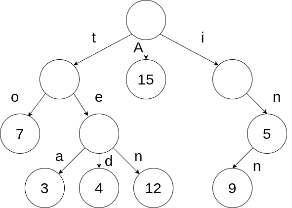

# Седмица 13 - Префиксни дървета

## Какво е префиксно дърво?
Префиксното дърво (Prefix tree, Trie) е йерархична структура от данни, имаща формата на дърво за търсене с произволен брой наследници, която е специализирана в съхранението и обработката на символни низове, с възможност към тях да бъдат асоциирани и стойности от произволен тип.

За разлика от до сега разгледаните дървета, префиксното дърво няма стойности във всеки един от възлите, но за сметка на това има стойности във всички ребра. На всяко ребро съответства точно един символ - по този начин можем да прочетем дума в дървото като минем по път от корена до някой възел. Не всеки път от корена до възел съответства на дума - за да бъде дума, трябва последният възел да съдържа стойност, която се асоциира с думата. Долната фигура е пример за такова префиксно дърво:

В това префиксно дърво се съдържат следните двойки от дума и стойност: to - 7, tea - 3, ted - 4, ten - 12, A - 15, in - 5, inn - 9. Забелязваме, че голяма част от думите споделят общо начало, което наричаме префикс (откъдето и името на структурата). Основното предимство на префиксното дърво всъщност е, че спестяваме много памет чрез споделяне на префиксите на низовете. Сложността на операциите по търсене, добавяне и премахване на дума имат сложност по време O(n), където n е броят на символите в думата.

Освен за ефективно съхранение на символни низове, префиксните дървета се използват често за построяване на речници, системи за autocomplete и за поправяне на грешки при спелуване.

## Модификации на префиксните дървета
Въпреки, че префиксните дървета спестяват доста памет, е възможно те да бъдат допълнително оптимизирани. Съществува вариант на префиксно дърво, наречен компресирано префиксно дърво (Radix trie), при който всички върхове, които са единствени наследници на даден връх, се обединяват със своя родител. Така на практика по ребрата е възможно да има поддуми вместо единични символи. Компресираните префиксни дървета са полезни, когато имаме дълги думи с общ префикс и се използва често в IP протокола за съхранение на адреси.

Оригиналната имплементация на префиксни дървета е направена да работи за символни низове, но на практика префиксните дървета могат да съхраняват всякакви последователности от наредени елементи. Популярен вариант е побитовото префиксно дърво, което по ребрата си съдържа битове и се използва за съхранение на данни в двоичен вид.

## Задача
Напишете шаблон на клас `Trie` представляващ префиксно дърво, който съдържа следните методи:

- `std::optional<T> lookup(const std::string& word) const` - намира стойността, отговаряща на подадената дума, ако думата е част от дървото
- `void insert(const std::string& word, const T& value)` - добавя нова дума към дървото, заедно със съответната ѝ стойност
- `void remove(const std::string& word)` - премахва дума от дървото, ако тя е част от него
- `std::vector<std::string> autocomplete(const std::string& prefix) const` - връща масив от всички думи в дървото, които започват с подадения префикс
- `std::vector<std::string> all_words() const` - връща масив от всички думи в дървото